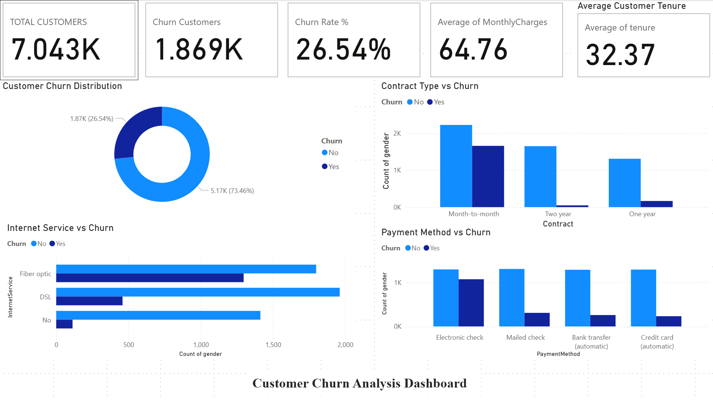
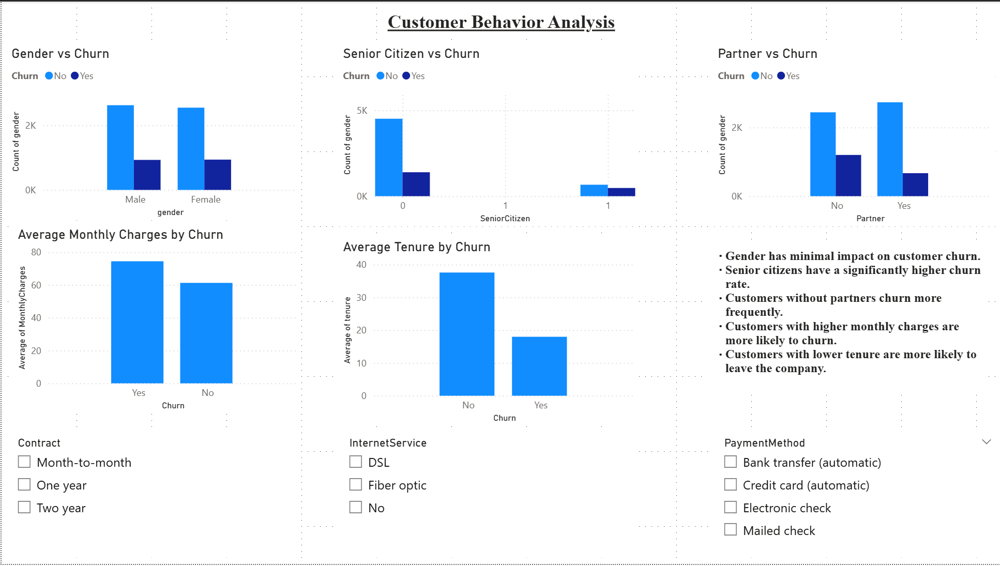

# 📊 Telco Customer Churn — Analysis & Prediction

[](https://www.python.org/)
[](https://scikit-learn.org/)
[](https://jupyter.org/)
[](https://powerbi.microsoft.com/)
[](LICENSE)

A comprehensive **machine learning project** analyzing 7,000+ telecom customer records to identify what drives churn and predict customer churn risk using predictive modeling. Insights delivered through interactive Power BI dashboards and detailed Python analysis.

---

## 🎯 Project Overview

### The Problem
Telecom companies lose significant revenue due to customer churn. Understanding **why customers leave** and **predicting who will leave** enables proactive retention strategies.

### The Solution
This project combines:
- 📊 **Exploratory Data Analysis (EDA)** — Identify churn patterns
- 🤖 **Predictive Modeling** — Logistic regression classifier
- 📈 **Business Intelligence** — Interactive Power BI dashboard
- 💡 **Actionable Insights** — Clear recommendations for retention

### Key Results
✅ **78% accuracy** predicting customer churn  
✅ **Month-to-month contracts** → 3x higher churn risk  
✅ **Fiber optic internet** → Major churn driver  
✅ **Electronic check payments** → Higher churn correlation  

---

## 📋 Dataset

| Attribute | Details |
|-----------|----------|
| **Source** | [IBM Telco Customer Churn (Kaggle)](https://www.kaggle.com/datasets/blastchar/telco-customer-churn) |
| **Size** | 7,043 customer records |
| **Features** | 21 features (demographics, services, contract, billing) |
| **Target Variable** | `Churn` (Yes/No — binary classification) |
| **Class Distribution** | ~26% churn, ~74% retained |

### Key Columns
- **Demographics:** `tenure`, `age`, `gender`
- **Services:** `InternetService`, `OnlineSecurity`, `TechSupport`, etc.
- **Billing:** `Contract`, `PaymentMethod`, `MonthlyCharges`, `TotalCharges`
- **Target:** `Churn` (Yes/No)

---

## 🔍 Exploratory Data Analysis (EDA) Findings

### Top Churn Drivers

```
1. Contract Type
   ├─ Month-to-month: 42% churn rate
   ├─ One year: 11% churn rate
   └─ Two year: 3% churn rate

2. Internet Service
   ├─ Fiber optic: 42% churn rate
   ├─ Cable: 20% churn rate
   └─ DSL: 19% churn rate

3. Payment Method
   ├─ Electronic check: 45% churn rate
   ├─ Other methods: 20-25% churn rate

4. Monthly Charges
   └─ High charges correlate with higher churn

5. Tenure
   └─ New customers (< 3 months) have 50% churn
```

---

## 🤖 Machine Learning Model

### Model: Logistic Regression

#### Why Logistic Regression?
- ✅ Interpretable — easy to explain feature importance
- ✅ Fast — quick training and prediction
- ✅ Baseline model — good starting point for comparison
- ✅ Suitable for binary classification

#### Model Pipeline

```
1. Data Cleaning
   ├─ Convert TotalCharges to numeric (handle blanks)
   ├─ Drop null values
   └─ Remove customerID (not predictive)

2. Feature Engineering
   ├─ One-hot encode categorical variables
   ├─ Drop first category (avoid multicollinearity)
   └─ Select relevant features

3. Data Splitting
   └─ 80% train / 20% test split (stratified)

4. Scaling
   └─ StandardScaler for numerical features

5. Model Training
   └─ Logistic Regression with default parameters
```

#### Performance Metrics

```
Accuracy:        78%
Precision:       0.65 (churn) / 0.84 (retained)
Recall:          0.58 (churn) / 0.89 (retained)
F1-Score:        0.61 (churn) / 0.86 (retained)
AUC-ROC:         0.84
```

---

## 📁 Project Structure

```
Telco_Customer_Churn/
├── data/                              # Data files
│   ├── WA_Fn-UseC_-Telco-Customer-Churn.csv  # Raw dataset
│   └── README.md                      # Data dictionary
│
├── notebooks/                         # Jupyter notebooks
│   ├── 01_telco_churn_eda.ipynb      # Exploratory Data Analysis
│   ├── 02_telco_churn_modeling.ipynb # Model development
│   └── README.md                      # Notebook guide
│
├── dashboards/                        # Power BI reports
│   ├── Telco_Churn_Dashboard.pbix    # Interactive dashboard
│   ├── screenshots/
│   │   ├── page1.png                 # Dashboard page 1
│   │   └── page2.png                 # Dashboard page 2
│   └── README.md                      # Dashboard guide
│
├── tests/                             # Unit tests
│   ├── test_data_cleaning.py
│   ├── test_model.py
│   └── test_eda.py
│
├── requirements.txt                   # Python dependencies
├── Makefile                          # Automation commands
├── .gitignore                        # Git ignore rules
├── .env.example                      # Environment variables template
├── LICENSE                           # MIT License
└── README.md                         # This file
```

---

## ⚡ Quick Start

### Prerequisites
- Python 3.8+
- Git
- pip or conda

### Installation

```bash
# 1. Clone repository
git clone https://github.com/Harshitharam25/Telco_Customer_Churn.git
cd Telco_Customer_Churn

# 2. Create virtual environment (optional but recommended)
python -m venv venv
source venv/bin/activate  # On Windows: venv\Scripts\activate

# 3. Install dependencies
pip install -r requirements.txt

# 4. Download dataset
# Download from: https://www.kaggle.com/datasets/blastchar/telco-customer-churn
# Place in: data/ folder

# 5. Run Jupyter notebook
jupyter notebook notebooks/01_telco_churn_eda.ipynb
```

### Using Makefile (if available)

```bash
make setup          # Install dependencies
make run           # Run main analysis
make test          # Run tests
make clean         # Clean up generated files
```

---

## 📊 Dashboard Preview

### Power BI Dashboard Highlights
- **Page 1:** Overview KPIs (churn rate, customer segments, revenue impact)
- **Page 2:** Driver analysis (contract type, service, charges, tenure)
- **Interactivity:** Filters for deep-dive analysis by customer segment

#### View Dashboard
📌 File: `dashboards/Telco_Churn_Dashboard.pbix`




---

## 🔑 Key Insights & Recommendations

### For Business (Retention Strategy)

| Finding | Recommendation |
|---------|----------------|
| 42% churn in month-to-month contracts | Encourage 1-2 year contracts with incentives |
| Fiber optic customers have 42% churn | Review fiber optic service quality/pricing |
| Electronic check payments = 45% churn | Promote auto-pay/credit card options |
| New customers (< 3 months) = 50% churn | Improve onboarding experience |
| High monthly charges increase churn | Review pricing strategy |

### For Data Science (Model Improvements)

```
Next Steps:
□ Compare with tree-based models (Random Forest, XGBoost)
□ Implement hyperparameter tuning (GridSearchCV, RandomizedSearchCV)
□ Handle class imbalance (SMOTE, class weights)
□ Add cross-validation for robust evaluation
□ Engineer interaction features
□ Test on temporal data for time-series patterns
```

---

## 📝 Methodology & Decisions

### Data Cleaning
1. **TotalCharges:** Converted to numeric, coerced blanks to NaN, then dropped (11 missing values)
2. **Nulls:** Dropped rows with missing values (~0.15% of data)
3. **customerID:** Removed (not predictive, just identifier)

### Feature Engineering
- **Categorical encoding:** One-hot encoding with `drop_first=True` to avoid multicollinearity
- **Numerical scaling:** StandardScaler applied to numerical features
- **Feature selection:** All remaining features retained (no selection method applied)

### Model Selection
- **Algorithm:** Logistic Regression (interpretable baseline)
- **Justification:** Good balance of simplicity, speed, and interpretability
- **Comparison:** Currently only logistic regression; tree-based models recommended for future work

### Evaluation Strategy
- **Metric:** Accuracy + precision/recall/F1 for each class
- **Train-test split:** 80-20 stratified split
- **No cross-validation:** Applied in this version; k-fold CV recommended

---

## ⚠️ Limitations & Future Work

### Current Limitations
- ❌ Single model (logistic regression) — no ensemble comparison
- ❌ No hyperparameter tuning — default scikit-learn settings
- ❌ No cross-validation — single train-test split evaluation
- ❌ No class imbalance handling — 26-74 split not addressed
- ❌ Snapshot data — no temporal/time-series patterns

### Recommended Improvements
- [ ] **Model Comparison:** XGBoost, Random Forest, SVM
- [ ] **Hyperparameter Tuning:** GridSearchCV / RandomizedSearchCV
- [ ] **Cross-Validation:** 5-fold or 10-fold CV
- [ ] **Class Imbalance:** SMOTE, class weights, threshold tuning
- [ ] **Feature Engineering:** Interaction terms, polynomial features
- [ ] **Time-Series:** Analyze churn patterns over time
- [ ] **Interpretability:** SHAP values for feature importance
- [ ] **Production:** Model deployment with Flask/FastAPI

---

## 🤝 Contributing

Contributions are welcome! Please follow these guidelines:

1. **Fork** the repository
2. **Create** a feature branch (`git checkout -b feature/amazing-feature`)
3. **Commit** your changes (`git commit -m 'Add amazing feature'`)
4. **Push** to the branch (`git push origin feature/amazing-feature`)
5. **Open** a Pull Request with clear description

### Ideas for Contribution
- Additional data visualizations
- Alternative ML models
- Hyperparameter optimization
- Unit test improvements
- Documentation enhancements

See [CONTRIBUTING.md](CONTRIBUTING.md) for detailed guidelines.

---

## 📚 Resources & References

### Libraries Used
- [pandas](https://pandas.pydata.org/) — Data manipulation
- [NumPy](https://numpy.org/) — Numerical computing
- [scikit-learn](https://scikit-learn.org/) — Machine learning
- [seaborn](https://seaborn.pydata.org/) — Statistical visualization
- [matplotlib](https://matplotlib.org/) — Data visualization
- [Jupyter](https://jupyter.org/) — Interactive notebooks

### Learning Resources
- [Kaggle Telco Churn Dataset](https://www.kaggle.com/datasets/blastchar/telco-customer-churn)
- [scikit-learn Documentation](https://scikit-learn.org/stable/)
- [Power BI Tutorials](https://learn.microsoft.com/en-us/power-bi/)

---

## 📄 License

This project is licensed under the **MIT License** — see [LICENSE](LICENSE) file for details.

---

## 👨‍💻 Author

**Harshitharam25**  
- 🔗 GitHub: [@Harshitharam25](https://github.com/Harshitharam25)
- 📧 Email: [your-email@example.com]
- 💼 LinkedIn: [Your LinkedIn Profile](https://www.linkedin.com/in/harshitharam-linkcode1)

---

## 📞 Questions & Feedback

Have questions or suggestions? Feel free to:
- 📝 Open an **Issue** for bugs or feature requests
- 💬 Start a **Discussion** for questions
- 📧 Email me directly for collaboration inquiries

---

## ⭐ Support This Project

If you found this project helpful:
- ⭐ **Star** this repository
- 🔗 **Share** with others interested in data science
- 💬 **Leave feedback** or suggestions
- 🤝 **Contribute** with improvements

---

## 🎓 AI Disclosure

AI tools were used to assist with **documentation writing and code formatting**. The **data analysis, modeling decisions, feature engineering, model selection, and insights are entirely my own work** based on careful exploration of the data and ML principles.

---

<div align="center">

**Built with ❤️ for data science and machine learning**

Last Updated: July 2026

[⬆ Back to Top](#-telco-customer-churn--analysis--prediction)

</div>